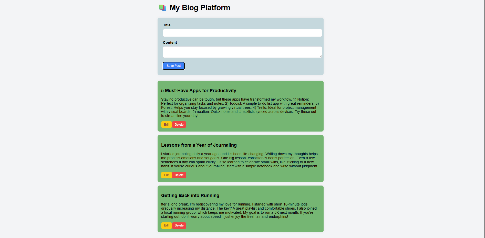

# Personal  Blog Post App

This is a lightweight blog post application built using  JavaScript ,html and css. It allows users to create, edit, and delete blog posts. All post data is stored in the browser's `localStorage`, ensuring persistence across sessions without requiring a backend server.

This project was developed as part of **SBA 5** to showcase **JavaScript**, **DOM handling**, and **form validation** skills.



## 🚀 Features

- Add new blog posts with a title and content.
- Edit existing blog posts.
- Delete blog posts.
- Real-time validation for required fields.
- Persistent data storage using `localStorage`.

## 📂 Project Structure

- `index.html`: Main HTML structure.
- `style.css`: Basic styling for the blog interface.
- `script.js`: Core JavaScript logic (as provided in this project).

## 🛠️ How to Run

To run the application, simply:

1. Clone or download this repository.
2. Open `index.html` in any modern web browser (no server setup required).

```bash
git clone https://github.com/MeronTeweldebrhan/Personal-Blog-Platform
cd blog-post-app
open index.html
```
## 💭 Reflection
What went well:
* I used localStorage effectively to persist user data between page reloads.
* I ensured form validation and error messaging was clear and responsive.

## Challenges faced:
* Ensuring that post IDs were unique and managing post state updates required careful use of localStorage.
* Implementing seamless editing functionality and maintaining the correct editId during dynamic operations was tricky.
* Managing DOM updates after operations like delete and edit without reloading the page 

## How I overcame them:
* I used unique numeric IDs generated randomly for post identification.
* I wrote separate functions to handle storage and rendering to keep concerns clean and make the logic modular.
* Console logs and debugging helped me trace where posts weren’t being updated correctly.

## Future to Improvements
* No character limits or rich text editing — content is plain text.
* No user authentication — this app is intended as a demo or for personal local use.
* Adding a confirmation prompt before deletion would improve user experience.
* Currently, posts are displayed without any timestamps or sorting.
* add filterin sorting by words

